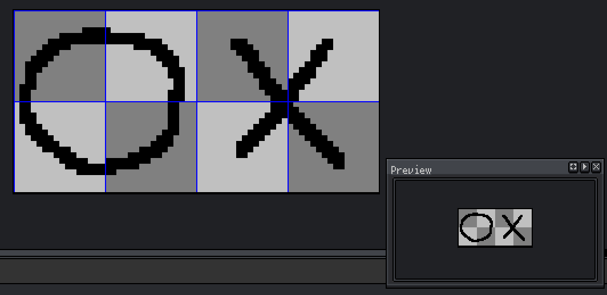
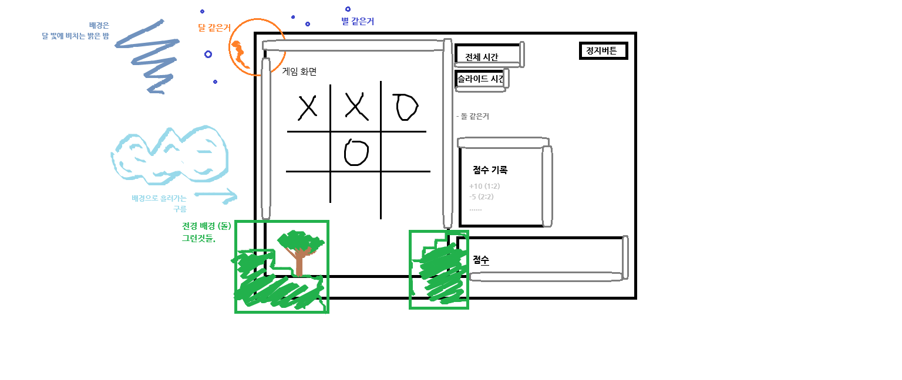

# [Tic-Tac-Toe AI Game (play link)](https://taxi-tabby.github.io/tictactoe-ai-game/)

Still in development.  
Currently testing features.  

[About this game](https://github.com/taxi-tabby/tictactoe-ai-game/tree/convert-to-phaser/game)

----

[Latest Development Progress](https://github.com/taxi-tabby/tictactoe-ai-game/tree/convert-to-phaser)

----

## Development Notes


### 2025-03-17 (2)

Phaser Container 에서 depth 가 갱신되지 않는 문제가 있었는데.
Container 객체의 sort 메서드에서 해결 가능했음. 따로 자료를 못 찾아서 시간이 조금 들어감.

```typescript
const containerObject: Phaser.GameObjects.GameObject;
containerObject.sort('depth'); // 다음 메서드를 호출해서 랜더링 뒤 바뀐 depth를 갱신 가능함.
``` 


### 2025-03-17 (1)

 

에셋 그리기 하는데 잘 그릴 방법이 없어서 그냥 꼬물딱 꼬물딱 애니메이션으로 추출. 추출한대로 잘 그려지는지 랜더링 테스트를 해야 함.


### 2025-03-14 (2)

콜백 문제를 해결했음.
이제 GridLayout > GridLayout | GridLayout[] 구성에서 최대 크기 계산과 하위 그리드 계산을 위해
parentObject 를 하나 만들고 하위로 들어가는 객체에 상위 객체를 입력해 접근 가능하여 하여
하위 객체가 상위 객체의 크기를 넘지 못하게 해야 함.
GridLayout 가 undefined 인 객체는 최상위 객체가 되고 canvas의 전체 크기를 먹게 하는것임.
하위 객체인 경우 상위 객체에 접근하여 크기 및 기능을 얻을 수 있음.
크기를 조회하나느 동작의 메서드에 해당 개념을 적용하면 자동으로 모든 객체에 크기가 적용될 것임.

그리고 보다 이쁘게 작성 가능하도록 콜백 활용했음 아래는 코드의 일부를 인용한 예시임.
```typescript

const globalContainer = createLayerContainer(this, 'c1', 0, gridSize.x, gridSize.y);
const innerContainer = createLayerContainer(this, 'c2');


/// globalContainer 안에 innerContainer 를 1,1 위치에 입력하므로 하위 컨테이너를 만듬.
globalContainer.addToGrid(innerContainer, 1, 1, { callbackHierarchicalCreate: (parentAny, selfAny) => {

    //상위 오브젝트
    const parent = parentAny as GridLayout;

    //상위에서 추가되는 오브젝트
    const self = selfAny as GridLayout;

    self.addToGrid({Phaser 게임 오브젝트}, 0, 0, {callbackRenderUpdate: (gameObject) => {
        ...
    }});
    ...

    //위치 업데이트
    self.layoutGrid();
}});


//하위 컨터이너 생성 시작 (callbackHierarchicalCreate 콜백을 호출함.)
//라이프 사이클 개념 확립 전 까진 수동 실행이 한계
globalContainer.runHierarchicalEvent(innerContainer);

//위치 업데이트
globalContainer.layoutGrid();

```

### 2025-03-14 (1)

GridLayout > GridLayout > Phaser.GameObjects.Graphic 이 있을 때
GridLayout1 에서 addToGrid 메서드로 GridLayout2를 추가 할 때 callbackRenderUpdate 옵션을 통해서 
GridLayout2.addToGrid(Phaser.GameObjects.Graphic) 을 하면 
GridLayout1 에서 GridLayout2 에 대한 callbackRenderUpdate 콜백을 실행하지 않기 때문에 별도의 콜백 옵션을 통해서 하위 객체 생성을 시도해야 할 것. 

그런 버그가 있어서 곤란해 곤란해~ 

GridLayout는 Phaser.GameObjects.Container 을 extend 한 객체.
기존의 Container 의 속성과 동작은 그대로 하지만 내부 시스템으로 비시각적인 Grid 영역 계산을 하며 이 좌표를 얻는 것이 가능.  
UI 제작을 체계적으로 하기 위해서 해당 로직을 작성하고 있으며. 아직 성능적인 테스트는 뒷전. 
기능적으로 더 만들어야 할 것이 더 많음.

rexui 플러그인은 제가 생각하던 기능이 아니였던 것 같지만 설계상 호환되므로 유지하고 필요 시 의존하기로 함

### 2025-03-13

ai 모델 작업을 계속 진행하고 있고. ui 관련해서 라이브러리 없는 줄 알았는데 rexui 라는게 있어서 이거 사용해서 할 것. 
layout 그려주는 기능 작업하는건 일시중지. ui 관런 컴포넌트 생성에 대한 내용이 많이 적혀있음. 파악이 필요해보임.
일단 상위 그리드, 하위 그리드로 나누고 계속 영역을 쪼개서 디자인 하고 싶은데 어디까지 가능한지 라이브러리 파악이 필요해보임.   

### 2025-03-07

 


그림판으로 대충 이런 테마로 가기로 했음. 게임 플레이 화면을 중점으로 다른 ux/ui를 구현예정

테마가 나왔으니 Pixabay, itch.io 같은 곳에서 이용 가능해보이는 무료 에셋을 조금 가져왔음. 
한번적용을 해보고 sfx를 봐야겠음. 

그리고 받은 에셋이 .aseprite 파일이 많아서 보니 편히 쓰려면 2만원이고 무료로 쓰는 오픈소스는 직접 빌드해서 쓰라캐서 어쩔 방안이 없어 빌드 했음.

그리고 sprite 가공이 쥰내 귀찮아서 python으로 png대상 json 프레임 생성기 뚝딱해서 돌려서 씀.
asset 에서 파일명 끝이 __sppx__.png로 끝나면 해당 이미지의 프레임 json을 생성함.

이미지 에셋 관리 클레스와 로드 하는 부분도 이에 맞춰서 약간의 변동이 생겼음.


 


레이아웃 구현을 위한 기능을 작성함. 그리드 형식이고 이걸로 비율기반 계산이 가능해짐. 아직까진 문제는 없음. 
계층적으로 동작함.

### 2025-03-06
phaser 코드 기반 작업 완료. 화면을 어떤 테마로 띄울껀지 자료좀 대충 찾아보고 있음.
2d게임엔진 공부도 되는 듯.

### 2025-03-05
ui에 대해 변경사항이 있음.
어중간하게 phaser를 넣으니까 좀 다 이상하네. 처음부터 그냥 로드해서 장면 생성해서 써야겠다.  
갈아엎어야지

### 2025-03-04
모델 문제가 인식됨.
텐서플로우로 모델 작업했는데 데이터 가공에 문제가 있던 듯 함. 예측이 상상한 것 보다 못함.
학습을 모든 상황에서의 내가 누군지도 모르는 상태에서의 가장 많이 두었던 칸을 학습시켰는데. 이게 문제가 됨.
조금 다른 방향으로 학습을 해야하고. 방법을 찾아야겠음. 떠오르는건 있는데 불명확함.

그리고 3x3칸에 대해 오프닝이 같으면 동일한 예측을 하길레 적용된 모델을 기반으로 Q러닝을 적용해서 랜덤섬을 부여했음. 덕분에 게임 속도가 너무 느려짐. 학습에 지연 및 프레임 드랍이 발생함. 적당한 선을 찾아야겠음.  

### 2025-03-03
ui구현이 대충 어느정도 끝남. 실제 게임 화면에 효과를 넣기 위해 실 게임에만 phaser 프레임워크를 적용하고 화면을 구현하려고 했음. element로 효과를 넣을려니 효과가 클릭 이벤트 영역을 가릴 것이라는 예측이 있었음. 조금 고민을 해야 함.

모델은
데이터를 학습하는데 pc가 구식에 amd용 메인보드라 cuda 지원이 잘 안되는 것으로 추측됨. gpu 인식이 안됨. 노트북, pc 2개를 따로 써서 cpu로 학습시키고 있음. 학습용 레이어 구분이나 설정을 2개로 나누고 각각 돌려서 정확도를 봤음.
점점 튜닝할수록 올라서 정확0.5 에서 0.9 까지 올림. 내일 테스트용 ui에 적용해서 예측되는지 돌려보겠음

### 2025-03-02
ui는 웹으로 구현하기로 했음. react에 대충 tictactoe 인터페이스 구현해서 돌리면 되겠지 함.
화려한 효과도 어느정도 적용되면 좋겠음.

사운드나 이미지는 외부 무료 사이트를 이용해 생성하거나 가공했음.
전부 저작권이 없는 선에서 생성된 것들임. 

모델은
tic-tac-toe 게임에 대한 데이터를 찾아야 했음. 그렇다고 돈 주고 사긴 싫고 있는지도 모르겠고 찾아보기도 싫어서
직접 데이터를 가공하기로 함.

다만 tictactoe를 직접 수십만판 해서 데이터를 얻는건 선을 넘은 것 같아서 기계적으로 데이터를 생성함.
https://smallbrain-labo.work/game/train/tictactoe 이 페이지를 웹으로 열어서 데이터를 가공함. 
학습용 데이터에 대한 설명은 페이지 내부에 적혀있음.

### 2025-03-01
게임 사전준비 했음. 어떤 게임방식이 좋겠는지. 이것을 함으로서 내가 얻는 것 등등. 가치를 매겠음.
결심이 섰고 간단히 텐서플로우는 tfjs로 웹에서 돌릴 수 있으니까 이걸 쓰기로 했음. 